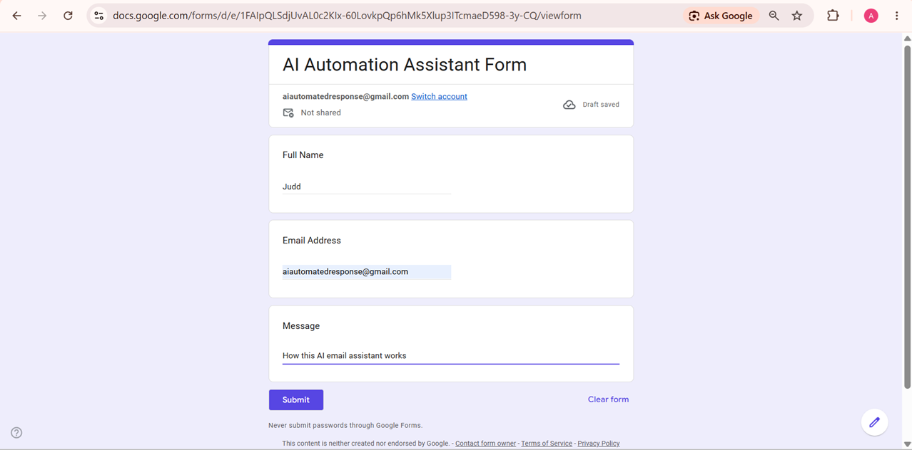
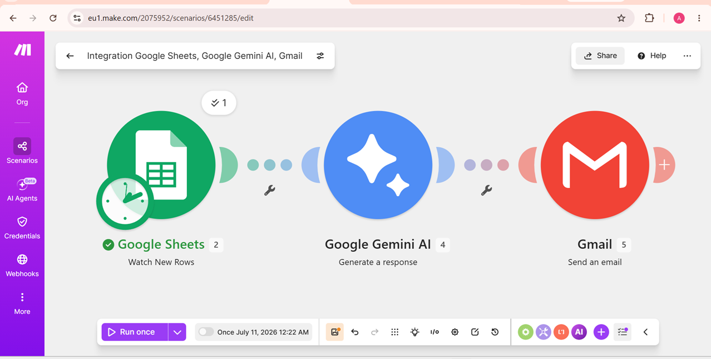
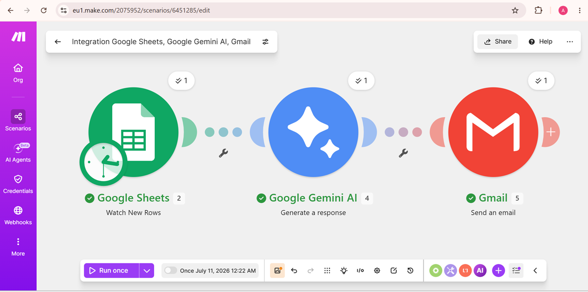
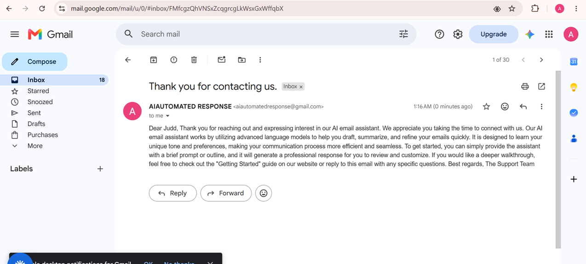

# AI Email Assistant

## Overview
This automation receives customer inquiries through Google Forms and automatically generates personalized responses using Google Gemini AI.

## Tools Used
- Make.com
- Google Forms
- Google Sheets
- Google Gemini
- Gmail

## Workflow

Google Form
↓
Google Sheets
↓
Gemini AI
↓
Gmail

## Business Value
- Saves time
- Provides instant responses
- Reduces manual customer support work

## Screenshots
### Google Form

### Make.com Workflow

### Successful Execution

### AI Generated Email

## Demo Video
https://www.loom.com/share/a889a2f3819a46a5b0843617c7f9be2c
